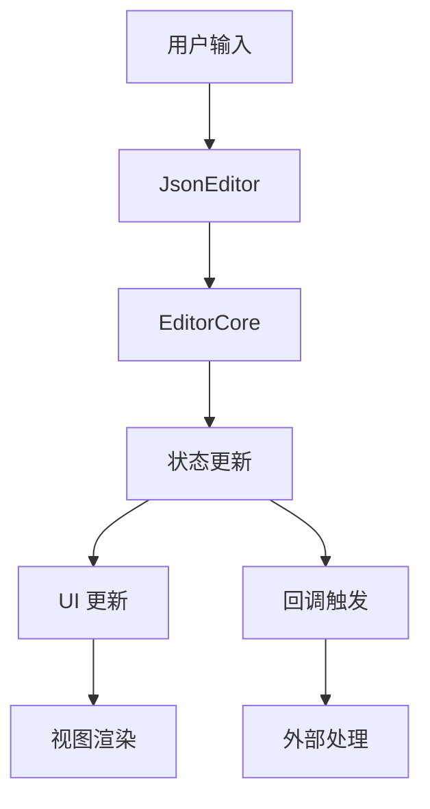

# 架构设计

> "优秀的架构源于对问题本质的深刻理解。JSON 编辑器的架构设计不仅要满足当前需求，更要为未来的扩展预留空间。"

## 设计理念

JSON 编辑器的架构设计遵循以下核心原则：

1. **分层设计** - 清晰的职责划分，便于维护和扩展
2. **可扩展性** - 灵活的插件系统，支持功能定制
3. **高性能** - 优化的状态管理，高效的渲染机制
4. **可测试性** - 松耦合的组件设计，便于单元测试
5. **开发友好** - 直观的 API 设计，完善的类型支持

## 核心架构

```
src/
├── core/               # 核心功能
│   ├── editor-core.ts  # 编辑器核心类
│   ├── types.ts        # 类型定义
│   └── schema-validator.ts # Schema 验证器
├── extensions/         # 扩展功能
│   ├── state.ts        # 状态管理
│   ├── event.ts        # 事件处理
│   ├── features.ts     # 基础功能
│   ├── themes.ts       # 主题系统
│   ├── decoration.ts   # 装饰系统
│   └── config.ts       # 配置管理
├── ui/                 # UI 组件
│   ├── JsonEditor.tsx  # 主组件
│   └── components/     # 子组件
│       ├── Toolbar.tsx
│       ├── StatusBar.tsx
│       └── SchemaInfoPanel.tsx
├── jsonkit/           # JSON 工具
│   ├── parser.ts      # 解析器
│   ├── path.ts        # 路径处理
│   └── schema/        # Schema 相关
└── utils/            # 工具函数
    ├── clipboard.ts   # 剪贴板
    ├── function.ts    # 函数工具
    └── svg.ts         # SVG 图标
```

## 核心模块

### 编辑器核心 (editor-core.ts)

编辑器的核心实现，负责：

1. **状态管理**
   - 文档内容
   - 选择范围
   - 编辑历史

2. **扩展系统**
   - 功能扩展
   - 主题扩展
   - 装饰扩展

3. **事件处理**
   - 内容变更
   - 光标移动
   - 焦点管理

```typescript
class EditorCore {
    private view: EditorView;
    private config: EditorConfig;
    private extensions: Extension[];

    // 核心方法
    getValue(): string;
    setValue(value: string): void;
    updateConfig(config: EditorConfig): void;
    destroy(): void;
}
```

### 扩展系统

#### 状态管理 (state.ts)

使用 CodeMirror 的状态系统管理编辑器状态：

```typescript
// 光标位置状态
const cursorStateField = StateField.define<CursorInfo>({
    create: () => ({ line: 1, col: 1 }),
    update: (value, tr) => {
        if (!tr.selection) return value;
        // 更新光标位置...
    }
});

// 文档大小状态
const docSizeStateField = StateField.define<DocSize>({
    create: () => ({ lines: 1, bytes: 0 }),
    update: (value, tr) => {
        if (!tr.docChanged) return value;
        // 更新文档大小...
    }
});
```

#### 事件系统 (event.ts)

处理编辑器的各种事件：

```typescript
class EditorEventPlugin {
    // 文档变化
    handleDocChange(value: string): void;
    
    // 光标移动
    handleCursorActivity(info: CursorInfo): void;
    
    // 焦点管理
    handleFocus(hasFocus: boolean): void;
}
```

#### 功能系统 (features.ts)

提供编辑器的基础功能：

```typescript
// 创建基础功能
function createBasicFeatures(settings: CodeSettings): Extension[] {
    return [
        history(),              // 历史记录
        lineNumbers(),          // 行号
        bracketMatching(),      // 括号匹配
        highlightActiveLine(),  // 高亮当前行
        // ...
    ];
}

// 创建自动补全
function createCompletionExtension(
    settings: CodeSettings,
    schema: object
): Extension[] {
    // 实现自动补全...
}
```

#### 主题系统 (themes.ts)

管理编辑器的视觉样式：

```typescript
// 暗色主题
const darkTheme = EditorView.theme({
    "&": {
        backgroundColor: "#282c34",
        color: "#abb2bf"
    },
    // ...
});

// 亮色主题
const lightTheme = EditorView.theme({
    "&": {
        backgroundColor: "#ffffff",
        color: "#24292e"
    },
    // ...
});
```

#### 装饰系统 (decoration.ts)

提供丰富的视觉增强：

```typescript
class DecorationFactory {
    // 创建路径装饰
    createPathDecoration(
        style: DecorationStyle,
        value: string
    ): Decoration[];
    
    // 创建链接装饰
    createUrlDecoration(
        url: string
    ): Decoration;
}
```

### UI 组件

#### JsonEditor (JsonEditor.tsx)

主组件，整合所有功能：

```typescript
const JsonEditor = forwardRef<EditorCore, JsonEditorProps>((props, ref) => {
    // 状态管理
    const [error, setError] = useState<string | null>(null);
    const [cursorInfo, setCursorInfo] = useState({ line: 1, col: 1 });
    
    // 编辑器实例
    const editorRef = useRef<EditorCore | null>(null);
    
    // 配置处理
    const handleChange = useCallback((value: string) => {
        // 处理变更...
    }, []);
    
    // 渲染组件
    return (
        <div className={className} style={style}>
            <Toolbar config={toolbarConfig} />
            <div ref={containerRef} />
            <StatusBar config={statusBarConfig} />
            <SchemaInfoPanel config={schemaInfoConfig} />
        </div>
    );
});
```

## 数据流



## 扩展机制

编辑器提供了多层次的扩展机制：

1. **配置扩展**
   - 通过配置对象定制行为
   - 支持运行时更新
   - 提供默认值

2. **功能扩展**
   - 使用 CodeMirror 扩展系统
   - 支持自定义命令
   - 可添加新功能

3. **视觉扩展**
   - 自定义主题
   - 装饰系统
   - 样式覆盖

4. **行为扩展**
   - 事件处理
   - 快捷键定制
   - 上下文菜单

## 性能考虑

1. **状态管理**
   - 使用 CodeMirror 的高效状态系统
   - 避免不必要的状态更新
   - 优化大文档处理

2. **渲染优化**
   - 虚拟滚动
   - 增量更新
   - DOM 重用

3. **内存管理**
   - 及时清理资源
   - 避免内存泄漏
   - 优化大文本处理

4. **事件处理**
   - 事件防抖
   - 批量更新
   - 优化回调

## 测试策略

1. **单元测试**
   - 核心功能测试
   - 工具函数测试
   - 状态管理测试

2. **集成测试**
   - 组件交互测试
   - 事件流测试
   - 扩展系统测试

3. **性能测试**
   - 大文档处理
   - 内存使用
   - 渲染性能

4. **E2E 测试**
   - 用户操作流程
   - 跨浏览器兼容性
   - 真实场景模拟

## 未来规划

1. **架构优化**
   - 进一步模块化
   - 提升扩展性
   - 优化性能

2. **功能增强**
   - 协同编辑
   - 更多编辑功能
   - 更强大的 Schema 支持

3. **开发体验**
   - 更好的调试工具
   - 更完善的文档
   - 更多示例

4. **生态建设**
   - 插件市场
   - 主题商店
   - 社区贡献

> 💡 **技术思考**: JSON 编辑器的架构设计体现了"可扩展性优先"的理念。通过精心设计的分层架构和扩展机制，我们不仅满足了当前的需求，更为未来的发展预留了充足的空间。这种设计思路启发我们：好的架构应该像一个有机的生命体，能够随着需求的变化而不断进化。 